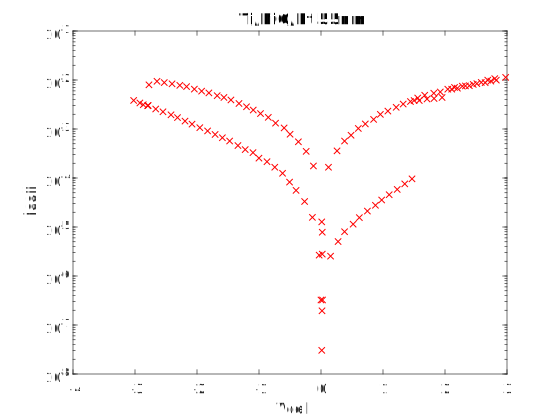

# RRAM I-V Sample Data #1

Device description:
1. Device structure: Ti/NiO/Pt 
2. Resistive switch type: bipolar
3. Oxide layer thinkness: 55nm

# Plot I-V sample data

# Data

[raw ascci V-I ](i-v-1.csv)

[matlab](i-v-1.mat)

note: first column: voltage (*Vcell*), second column: absolute value of the current (*Icell*)

# Reference

Extracted from:

G. Ma, X. Tang, H. Su, Y. Li, H. Zhang and Z. Zhong, "Effects of Standard Free Energy on NiO Bipolar Resistive Switching Devices," in IEEE Transactions on Electron Devices, vol. 61, no. 5, pp. 1237-1240, May 2014.

doi: 10.1109/TED.2014.2309975

URL: http://ieeexplore.ieee.org/stamp/stamp.jsp?tp=&arnumber=6777282&isnumber=6802373

