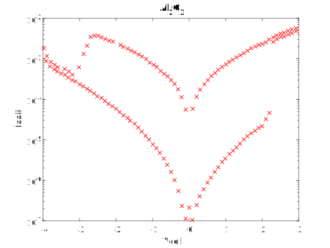

# RRAM I-V Sample Data #5

Device description:
1. Device structure: Al2O3 
2. Resistive switch type: bipolar
3. Oxide layer thinkness: 

# Plot I-V sample data

# Data

[raw ascci V-I ](i-v-2-1.csv)

[matlab](i-v-2-1.mat)

note: first column: voltage (*Vcell*), second column: absolute value of the current (*Icell*)

# Reference

Extracted from:

Lin, C.-Y., Wu, C.-Y., Wu, C.-Y., Hu, C., & Tseng, T.-Y. (2007). Bistable Resistive Switching in Al[sub 2]O[sub 3] Memory Thin Films. Journal of The Electrochemical Society, 154(9), G189. https://doi.org/10.1149/1.2750450
