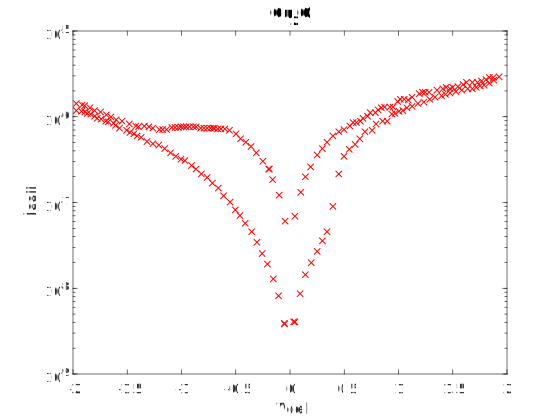

# RRAM I-V Sample Data #6

Device description:
1. Device structure: Cu2O 
2. Resistive switch type: bipolar
3. Oxide layer thinkness: 

# Plot I-V sample data

# Data

[raw ascci V-I ](i-v-2-2.csv)

[matlab](i-v-2-2.mat)

note: first column: voltage (*Vcell*), second column: absolute value of the current (*Icell*)

# Reference

Extracted from:

Resistance random access memory (RRAM). <http://archive.today/c6PS>