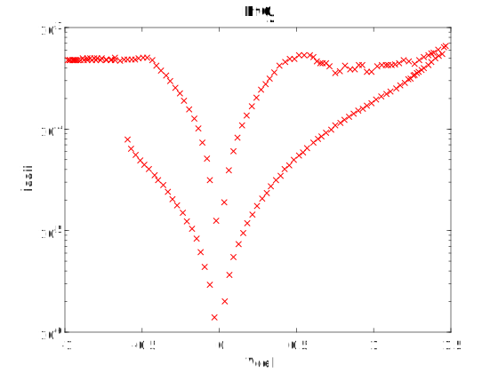

# RRAM I-V Sample Data #7

Device description:
1. Device structure: HfO2 
2. Resistive switch type: bipolar
3. Oxide layer thinkness: 5nm

# Plot I-V sample data

# Data

[raw ascci V-I ](i-v-2-3.csv)

[matlab](i-v-2-3.mat)

note: first column: voltage (*Vcell*), second column: absolute value of the current (*Icell*)

# Reference

Extracted from:

Blasco, J., Jančovič, P., Fröhlich, K., Suñé, J., & Miranda, E. (2014). Modeling of the switching I-V characteristics in ultrathin (5 nm) atomic layer deposited HfO2 films using the logistic hysteron.  https://doi.org/10.1116/1.4900599