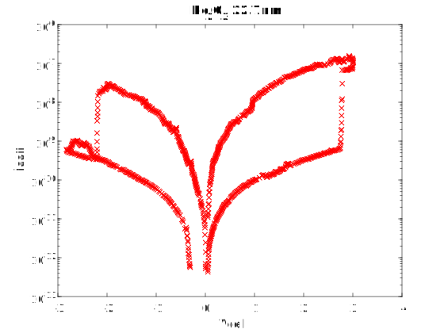

# RRAM I-V Sample Data #10

Device description:
1. Device structure: Ho2O3
2. Resistive switch type: bipolar
3. Oxide layer thinkness: 22.7 nm

# Plot I-V sample data

# Data

[raw ascci V-I ](i-v-2-6.csv)

[matlab](i-v-2-6.mat)

note: first column: voltage (*Vcell*), second column: absolute value of the current (*Icell*)

# Reference

Extracted from:

