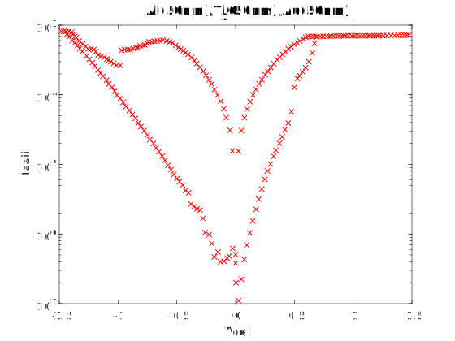

# RRAM I-V Sample Data #14

Device description:
1. Device structure: Al/TiO2/Au
2. Resistive switch type: bipolar
3. Oxide layer thinkness: 50nm

# Plot I-V sample data

# Data

[raw ascci V-I ](i-v-2-10.csv)

[matlab](i-v-2-10.mat)

note: first column: voltage (*Vcell*), second column: absolute value of the current (*Icell*)

# Reference

Extracted from:

