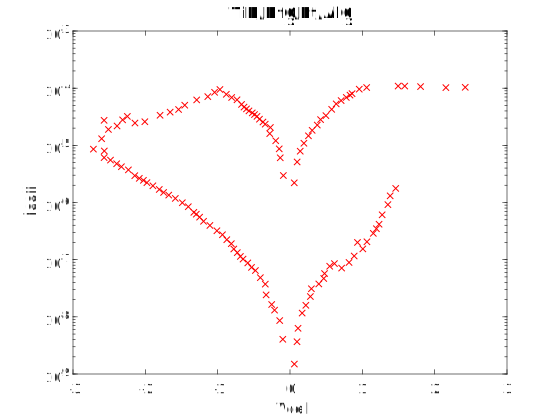

# RRAM I-V Sample Data #15

Device description:
1. Device structure: Ti/HfOx/Pt/AlOx
2. Resistive switch type: bipolar
3. Oxide layer thinkness:

# Plot I-V sample data

# Data

[raw ascci V-I ](i-v-2-11.csv)

[matlab](i-v-2-11.mat)

note: first column: voltage (*Vcell*), second column: absolute value of the current (*Icell*)

# Reference

Extracted from:

